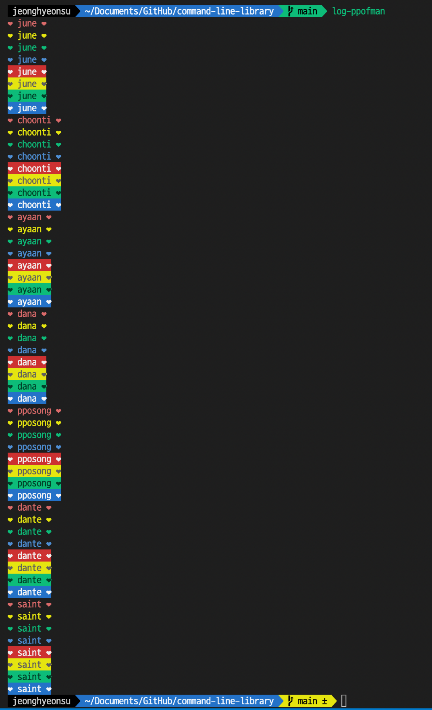

# command-line-library with lerna with PPO-F-MAN
CLI 명렁어로 동작하는 NPM 패키지 만들어보기

# install

```
// npm
$ npm install -g log-ppofman

// yarn
$ yarn global add log-ppofman 
```

# execute

```
$ log-ppofman
$ log-june
$ log-choonti
$ log-ayaan
$ log-dana
$ log-pposong
$ log-dante
$ log-saint
$ log-hyeonsu
```

### BOOM



# uninstall

```
// npm
$ npm uninstall -g log-ppofman

// yarn
$ yarn global remove log-ppofman
```

### 참고

- [Lerna를 활용한 Mono-Repo 구축 완벽 가이드](https://kdydesign.github.io/2020/08/25/mono-repo-lerna/)
